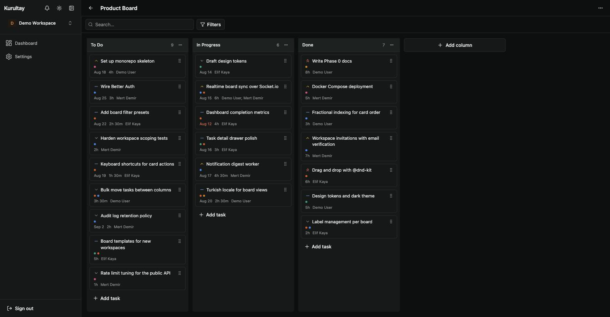

# Kurul

Open-source, Kanban-focused project management tool.

[](https://github.com/dravcore/kurul/actions/workflows/ci.yml) [](https://github.com/dravcore/kurul/actions/workflows/codeql.yml) [](https://github.com/dravcore/kurul/releases) [](LICENSE)



> 🌐 English (canonical) | [Türkçe](README.tr.md)

## Status

Kurul’s **MVP feature set (Phases 1–9) is complete** (Phase 0 was docs/standards) — auth/workspaces, boards and
tasks, filtering, dashboard, activity/notifications, and realtime board sync. See
[docs/roadmap.md](docs/roadmap.md). A six-scenario Playwright smoke pack covers the critical
browser flows ([docs/testing.md](docs/testing.md#browser-end-to-end)). Beyond-MVP items (email
notifications, presence, extra locales, …) remain listed under Beyond MVP.

## What is Kurul?

**Kurul** is Turkish for a council — the body that convenes, decides, and divides the work
among itself. That is the shape of what this tool does for a team: people gather around a
board, discuss the work, decide what matters, and divide tasks among themselves — tracked,
prioritized, and visible to everyone.

The project was called **Kurultay** until v0.2.0, after the great assembly of Turkic-Mongol
tradition. The shorter name keeps the same idea and the same root, and fits the domain the
project now lives on.

Kurul aims to be a self-hostable, AGPL-licensed alternative to commercial Kanban/PM tools
(Trello, Linear, Jira) for teams who want to own their data and their workflow.

## Why Kurul

Teams picking a self-hosted board rarely compare it to Trello — they compare it to the other
self-hostable options. Where that field stands today:

| Project                                                          | Where it stands                                                                                                                    |
| ---------------------------------------------------------------- | ---------------------------------------------------------------------------------------------------------------------------------- |
| [Planka](https://github.com/plankanban/planka)                   | Source-available, no longer OSI open source — "fair-code distributed under the Fair Use License and PLANKA Pro/Enterprise License" |
| [WeKan](https://github.com/wekan/wekan)                          | Fully open source (MIT), no paid tier; Meteor-based stack (Meteor 3.5 / Node.js 24)                                                |
| [Focalboard](https://github.com/mattermost-community/focalboard) | "This repository is currently not maintained" — work continues only as a Mattermost plugin                                         |
| [Vikunja](https://vikunja.io/pricing/)                           | AGPLv3 core, but the admin panel, audit logs and time tracking are Pro-only even on an instance you host yourself                  |
| [OpenProject](https://www.openproject.org/pricing/)              | GPLv3 Community Edition, Rails-based and enterprise-shaped; a set of features stays Enterprise-only                                |

Kurul's answer is deliberately narrow:

- **One license, one tier.** AGPL-3.0 for the whole codebase, nothing held back. The commercial
  model is dual licensing of that same code, not a paid feature build
  ([ADR 0014](docs/decisions/0014-dual-licensing-cla.md)).
- **Current stack, one compose file.** Next.js 16 / NestJS 11 / PostgreSQL 18, TypeScript end to
  end, `docker compose pull && docker compose up -d` for the whole thing — published images, no
  local build required.
- **Realtime and multi-tenancy in the core.** Socket.io board sync and workspace-scoped queries
  were designed in, not added on top.

And what it is not, at `v0.2.0`: no subtasks, no time tracking, no public API tokens or
webhooks. The UI speaks English and Turkish — every interface string, the columns a new board
is seeded with, and the email we send you — and a third language is a catalog away. API tokens,
webhooks and further language packs are listed under
[Beyond MVP](docs/roadmap.md#beyond-mvp), each with the open question holding it up; subtasks
and time tracking are not on that list at all. If you need them today, one of the more mature
projects above is the better choice.

## Features

Shipped in the MVP — sequencing history in [docs/roadmap.md](docs/roadmap.md):

- **Boards and columns** — classic Kanban layout with drag-and-drop reordering
- **Tasks** — multi-assignee, labels, priority (kept independent of labels), due date and
  time estimate as separate fields
- **Checklists** — multiple named checklists per task, each with its own items; a progress
  badge (`3/5`) shows on the board card and disappears when a task has none
  ([ADR 0023](docs/decisions/0023-checklist-data-model.md))
- **Attachments** — files and links on a card. Files are stored on your own disk, accepted on
  their magic bytes rather than their extension, and served back with a size limit you set;
  images preview in the panel. A link is stored, shown and opened — the server never requests
  the URL, so no preview fetch can be turned into a probe of your network
  ([ADR 0022](docs/decisions/0022-attachment-storage.md),
  [ADR 0024](docs/decisions/0024-attachment-kinds-and-serving-policy.md))
- **Trello import (one-way)** — upload a Trello board's JSON export and get a Kurul board:
  lists, cards, labels and checklists. It is one-way and not repeatable: **importing the same
  export twice creates two boards** — there is no update-in-place and no dedupe. Three things
  deliberately do not come across, and the import report tells you how many of each: **files**
  (a Trello export carries attachment URLs, not bytes, so they arrive as links the server never
  requests), **members** (a Trello account is not a Kurul account, so assignments are dropped
  and everything is attributed to you) and **comments**. Archived lists and cards are skipped too,
  and every imported column arrives as "not started" — Kurul never guesses which of your
  columns means "done", so you set that yourself afterwards. The report exists only in the
  response: it is shown once, it is not stored, and dismissing it is permanent
  ([ADR 0025](docs/decisions/0025-trello-import-mapping.md))
- **Fractional-indexed ordering** — reordering a card only touches that card's position,
  never a full-list renumber
- **Workspaces** — multi-tenant from the ground up, every query scoped by workspace
- **Filtering and search** — board task filters with cursor pagination
- **Dashboard** — aggregation views and charts (including created vs completed)
- **Activity log and notifications** — in-app assignment, mention, due-soon; `/notifications`
- **Realtime sync** — board changes propagate live via Socket.io
- **English and Turkish** — a per-user preference, not a per-workspace one, so one workspace
  can hold people who read different languages. It follows you to every device you sign in on,
  names the columns a board you create starts with, and picks the language of the email we
  send you. A build fails on a key one catalog has and the other does not
  ([ADR 0018](docs/decisions/0018-localization-strategy.md))

## Quick start

```bash
git clone https://github.com/dravcore/kurul.git
cd kurul
cp .env.example .env   # set BETTER_AUTH_SECRET (openssl rand -base64 32) and POSTGRES_PASSWORD (openssl rand -hex 32)
pnpm install
pnpm -r --filter @kurul/shared-types --filter @kurul/auth-access build   # shared packages, consumed from gitignored dist/
pnpm db:generate        # generate the Prisma client (gitignored, not created automatically)
docker compose -f docker-compose.dev.yml up -d
pnpm db:migrate
pnpm db:seed
pnpm dev
```

- Web: http://localhost:3000
- API health: http://localhost:4000/health

`POSTGRES_PASSWORD` has no default — compose refuses to start until it's set — and the
password segment of `DATABASE_URL` a few lines above it in `.env.example` must match it by
hand. Unlike `BETTER_AUTH_SECRET`, this value is embedded directly in a connection URL, so
`openssl rand -base64 32` is the wrong generator here — its alphabet includes `/` and `+`,
either of which breaks the URL if it lands in the password (`/` ends the authority section
outright; roughly half of all base64-32 outputs contain at least one). Use
`openssl rand -hex 32` instead, whose alphabet (`0-9a-f`) is always URL-safe; see
[docs/development.md#database-and-cache-credentials](docs/development.md#database-and-cache-credentials).

The app boots without SMTP configured, but invitations cannot be accepted until it is — the
dev compose file above already starts [Mailpit](https://mailpit.axllent.org/) so you can test
that flow locally without a real mail provider; see
[docs/development.md#smtp-and-mailpit](docs/development.md#smtp-and-mailpit).

Full stack in Docker, pull-based: `docker compose pull && docker compose up -d`, then open
http://localhost. Every tagged release publishes `api`/`web` images to GHCR
(`ghcr.io/dravcore/kurul-api`, `ghcr.io/dravcore/kurul-web`), so this installs and
upgrades without a local build; set `TAG=vX.Y.Z` in `.env` to pin a release instead of
`latest`. No image published yet for your `TAG` (or no network route to `ghcr.io`)?
`docker compose up -d` still falls back to building from source automatically —
`docker compose up --build` keeps working exactly as before, for building on purpose.
Day-to-day details: [docs/development.md](docs/development.md).

Both apps are served from one origin behind a bundled Caddy reverse proxy, so the **same
published image runs on any domain with no rebuild** — put it on your own by setting
`SITE_URL=https://kurul.example.com` in `.env`, which also turns on automatic HTTPS.
The one-page walkthrough, SMTP included: [docs/self-hosting.md](docs/self-hosting.md).

## Stack

| Layer        | Choice                                                                    |
| ------------ | ------------------------------------------------------------------------- |
| Backend      | NestJS 11 + Prisma 7 + PostgreSQL 18 + Redis 8 + Socket.io                |
| Frontend     | Next.js 16 (App Router) + Tailwind CSS + shadcn/ui + @dnd-kit + Recharts  |
| Auth         | Better Auth (organization plugin → Workspace)                             |
| Email        | `nodemailer` over SMTP (invitation verification)                          |
| Shared types | `packages/shared-types` + `packages/auth-access` (DTOs / BA org AC roles) |
| Deployment   | Docker Compose                                                            |
| Architecture | Monorepo, modular monolith — no microservices                             |

Full rationale for each choice: [docs/tech-stack.md](docs/tech-stack.md) and
[docs/decisions/](docs/decisions/).

## Documentation

Start with the five-minute map: **[docs/README.md](docs/README.md)** (what to read for
product, coding, API, releases, roadmap).

| Doc                                                | Covers                                    |
| -------------------------------------------------- | ----------------------------------------- |
| [docs/architecture.md](docs/architecture.md)       | Module map, data model                    |
| [docs/design.md](docs/design.md)                   | UI/UX language                            |
| [docs/development.md](docs/development.md)         | Local setup and daily commands            |
| [docs/api-conventions.md](docs/api-conventions.md) | REST, errors, pagination                  |
| [docs/roadmap.md](docs/roadmap.md)                 | MVP done; beyond-MVP backlog              |
| [docs/decisions/](docs/decisions/)                 | ADRs                                      |
| [docs/archive/](docs/archive/)                     | Historical specs, plans, phase checklists |

## Contributing

Bug reports, feature ideas, and design feedback are welcome and genuinely useful. **Outside
code, documentation, and translation pull requests are not accepted** — the codebase stays
single-authored, indefinitely ([ADR 0015](docs/decisions/0015-no-external-contributions.md)).
Kurul is issue-first: propose before you implement. See
[CONTRIBUTING.md](CONTRIBUTING.md) for the process, and
[CODE_OF_CONDUCT.md](CODE_OF_CONDUCT.md) for how we work together.

## Security

See [SECURITY.md](SECURITY.md) to report a vulnerability.

## License

[AGPL-3.0](LICENSE).
